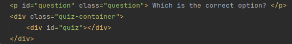
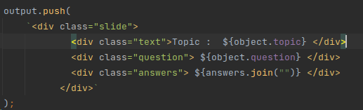
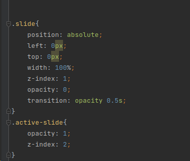
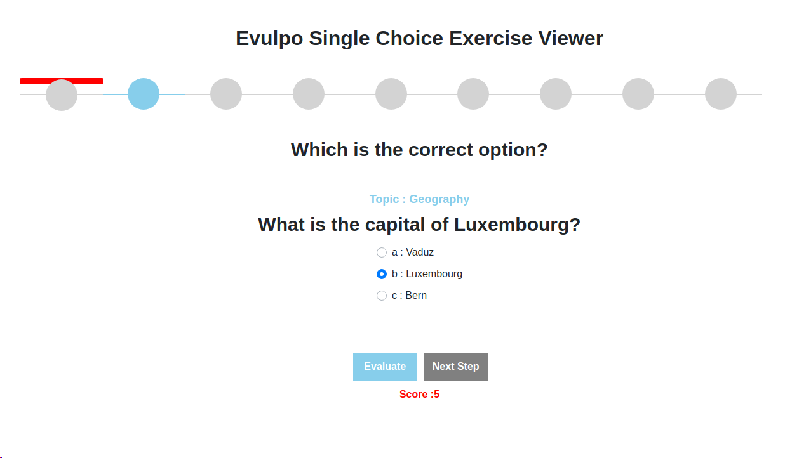
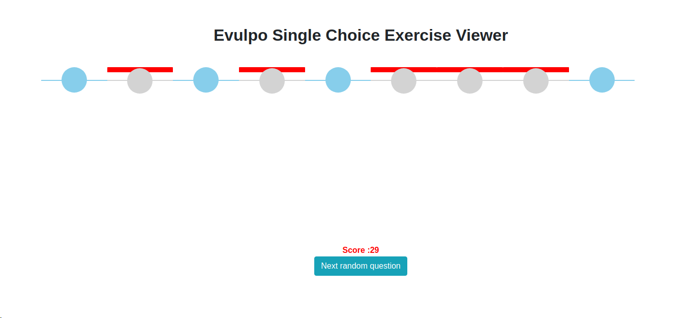

# evulpo_test
Single Choice Exercise Viewer

# Run the projet server
http-server -p 8000 
http://127.0.0.1:8000

The code in this article uses modern JavaScript syntax (ES6+),

# The Basic Structure
To set up the structure of our JavaScript quiz, we’ll need to start with the following HTML:

Next, we need to add a div element with class
slide to hold the question and answer on the main.js:

Next, we can use some CSS positioning to make the slides sit as layers on top of one another.
In this example, you’ll notice we’re using z-indexes and opacity transitions to allow our slides to fade in and out.
Here’s what that CSS might look like:

# Screens test

